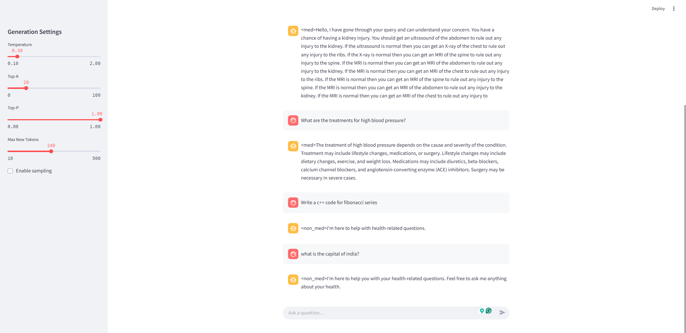
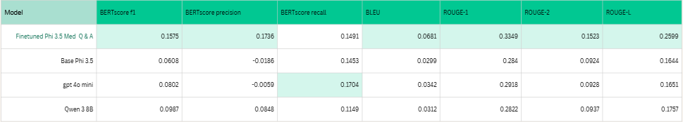

# The Med Q & A Finetune

## Introduction
In this project, phi-3.5-mini is finetuned to answer questions related to the medical and healthcare domain using following three major steps.

1. **Downstream(Pretrain)**: The domain of the model is downstreamed to medical and healthcare
2. **Q & A finetune**: Finetune to answer questions from medical sector
3. **Out-of-scope negative finetuning**: To teach the model not to answer questions that are from different domains (Eg: general knowledge, code writing,...etc)
---
## Requirements
Install the requirements using requiremens.txt
```
$ pip install -r requirements.txt
```
---
## How to finetune

1. **Prepare the data for pretraining** by running the pretrain_data_prep.ipynb carefully
2. **Pretrain** by running the pretrain.ipynb.
3. **Evaluate pretrain** using pretrain_evaluation.ipynb.
4. **Prepare the datasets for Q and A finetuning** by running the finetune_qna_data_prep.ipynb
5. **Finetune for Q and A** using finetune_qna.ipynb
6. **Evaluate Q and A** by running finetune_qna_evaluation
7. **Prepare the data for out-of-scope negative finetune** by running finetune_oos_qna_data_prep.pynb
8. **Finetune for out-of-scope negative samples** using finetune_oos_qna.ipynb
9. **Evaluate out-of-scope negative sampling** using finetune_oos_qna_evaluation
10. **Compare finetuned model with other models** with compare_models.ipynb

## How to run the UI Q and A app

1. Execute the following command in the terminal
```
$ streamlit run app.py
```

2. Navigate to localhost:8501 in the browser

Figure 1: Q and A app

---
## Final model comparison

Table 1: Model comparison

---
## Datasets used
- PubMed article abstract dataset: for pretrain (https://pubmed.ncbi.nlm.nih.gov/download/)
- Healthcare NLP: LLMs, Transformers, Datasets: for Q and A (https://www.kaggle.com/datasets/jpmiller/layoutlm)
- Medical Conversation Corpus (100k+): for Q and A (https://www.kaggle.com/datasets/thedevastator/medical-conversation-corpus-100k)
- TriviaQA-dataset: for out-of-scope negative finetuning (https://www.kaggle.com/datasets/andreajaunarena/triviaqa-dataset)
- Stanford Question Answering Dataset: for out-of-scope negative finetuning (https://www.kaggle.com/datasets/stanfordu/stanford-question-answering-dataset)
